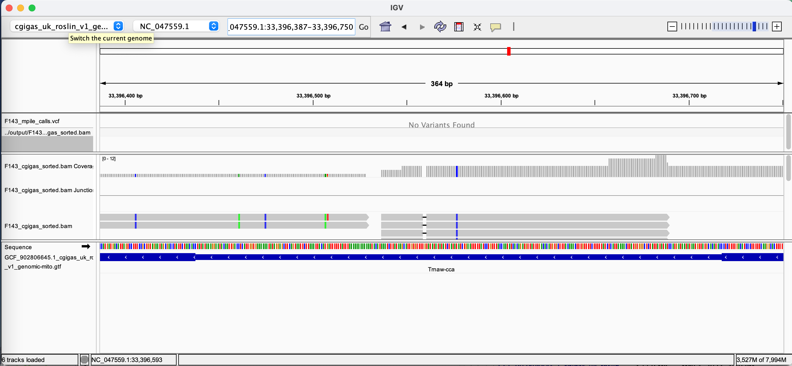

# Alignment Data

## SAMs and BAMs

[Alignment on RPubs](https://rpubs.com/cskalley/1038394)

### Downloading alignment data (BAM)

```{r, engine='bash', eval = FALSE}
cd ../data
curl -O https://gannet.fish.washington.edu/seashell/bu-mox/scrubbed/120321-cvBS/19F_R1_val_1_bismark_bt2_pe.deduplicated.sorted.bam
curl -O https://gannet.fish.washington.edu/seashell/bu-mox/scrubbed/120321-cvBS/19F_R1_val_1_bismark_bt2_pe.deduplicated.sorted.bam.bai
```

```{r, engine='bash', eval = FALSE}
cd ../data
curl -O https://gannet.fish.washington.edu/seashell/bu-mox/data/Cvirg-genome/GCF_002022765.2_C_virginica-3.0_genomic.fa
curl -O https://gannet.fish.washington.edu/seashell/bu-mox/data/Cvirg-genome/GCF_002022765.2_C_virginica-3.0_genomic.fa.fai
```

### Visualize with tview in terminal using:

/home/shared/samtools-1.12/samtools tview\
../data/19F_R1_val_1\_bismark_bt2_pe.deduplicated.sorted.bam\
../data/GCF_002022765.2_C\_virginica-3.0_genomic.fa

### Aligning WGS data and visualizing in IGV

```{r, engine='bash', eval = FALSE}
cd ../data
curl -O https://owl.fish.washington.edu/nightingales/C_gigas/F143n08_R2_001.fastq.gz
curl -O https://owl.fish.washington.edu/nightingales/C_gigas/F143n08_R1_001.fastq.gz
```

```{r, engine='bash', eval = FALSE}
cd ../data
curl -O https://gannet.fish.washington.edu/panopea/Cg-roslin/cgigas_uk_roslin_v1_genomic-mito.fa
curl -O https://gannet.fish.washington.edu/panopea/Cg-roslin/cgigas_uk_roslin_v1_genomic-mito.fa.fai
curl -O https://gannet.fish.washington.edu/panopea/Cg-roslin/GCF_902806645.1_cgigas_uk_roslin_v1_genomic-mito.gtf
```

### Alignment

```{r, engine='bash', eval = FALSE}
/home/shared/hisat2-2.2.1/hisat2-build \
-f ../data/cgigas_uk_roslin_v1_genomic-mito.fa \
../output/cgigas_uk_roslin_v1_genomic-mito.index
```

```{r, engine='bash', eval = FALSE}
/home/shared/hisat2-2.2.1/hisat2 \
-x ../output/cgigas_uk_roslin_v1_genomic-mito.index \
-p 4 \
-1 ../data/F143n08_R1_001.fastq.gz \
-2 ../data/F143n08_R2_001.fastq.gz \
-S ../output/F143_cgigas.sam
```

#Look at the data

```{r, engine='bash', eval = FALSE}
tail -1 ../output/F143_cgigas.sam

#OR COULD (MAYBE) USE THIS:
tail -1 /home/shared/8TB_HDD_01/sr320/github/steven-coursework/assignments/output/F143_cgigas.sam
```

```{r, engine='bash', eval = FALSE}
# Convert SAM to BAM, using 4 additional threads
/home/shared/samtools-1.12/samtools view -@ 4 -bS \
../output/F143_cgigas.sam > ../output/F143_cgigas.bam
```

```{r, engine='bash', eval = FALSE}
# Sort the BAM file, using 4 additional threads
/home/shared/samtools-1.12/samtools sort -@ 4 \
../output/F143_cgigas.bam -o ../output/F143_cgigas_sorted.bam

# Index the sorted BAM file (multi-threading is not applicable to this operation)
/home/shared/samtools-1.12/samtools index \
../output/F143_cgigas_sorted.bam
```

### mpileup using bcftools

```{r, engine='bash', eval = FALSE}
/home/shared/bcftools-1.14/bcftools mpileup --threads 4 --no-BAQ \
--fasta-ref ../data/cgigas_uk_roslin_v1_genomic-mito.fa \
../output/F143_cgigas_sorted.bam > ../output/F143_mpileup_output.txt
```

```{r, engine='bash', eval = FALSE}
tail ../output/F143_mpileup_output.txt
```

```{r, engine='bash', eval = FALSE}
cat ../output/F143_mpileup_output.txt \
| /home/shared/bcftools-1.14/bcftools call -mv -Oz \
> ../output/F143_mpile.vcf.gz
```

```{r, engine='bash', eval = FALSE}
zgrep "^##" -v ../output/F143_mpile.vcf.gz | \
awk 'BEGIN{OFS="\t"} {split($8, a, ";"); print $1,$2,$4,$5,$6,a[1],$9,$10}' | head

```

The code below might not work. That is fine. The VCF in the above chunk can be used for visualization in IGV.

```{r, engine='bash', eval = FALSE}
/home/shared/bcftools-1.14/bcftools call \
-v -c ../output/F143_mpile.vcf.gz \
> ../output/F143_mpile_calls.vcf
```

### Visualizing the data

#### screenshot of tview


#### bam file (raw)

```{r, engine='bash', eval = FALSE}
tail -20 ../output/F143_cgigas.bam
```

#### view bam file (in IGV)


#### view translations (in IGV)


#### view GCF (in IGV)


